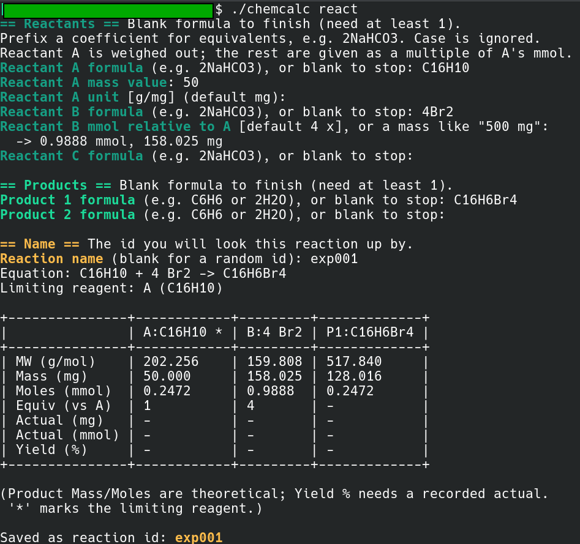

# chemcalc: calculation for Organic Chemistry Research
command-line tool for common organic chemistry bench calculations.
## Build

```sh
gcc -O2 -Wall -o chemcalc chemcalc.c -lm
```

## Usage

```
chemcalc mw FORMULA [--mass VALUE] [--unit g|mg|kg|ug]
chemcalc react
chemcalc list
chemcalc show ID
chemcalc yield ID ACTUAL_VALUE [--unit g|mg|kg|ug] [--product N]
chemcalc rename ID NEW_NAME
chemcalc delete ID [-f|--force]
```

### IDs and names

- Every saved reaction has an ID. 
- `react` asks for one at the end: type a name you will recognise later (`aldol-1`, `bromination.2`) or leave it
blank to get a random hex id. 
- Names may contain letters, digits, `-`, `_`and `.`, up to 32 characters, and must be unique. 
- `rename` changes the ID of a reaction that already exists. 

### Units

- Masses are milligrams and amounts are millimoles everywhere 
- `--unit` (and the interactive prompt) accepts `g`, `mg`, `kg`, `ug` and defaults to `mg`. 


### Formulas

Formula input is **case-insensitive**: `C6H6`, `c6h6`, and `ccl4` all parse
correctly. Parentheses and groups are supported, e.g. `Cu(OH)2`.

* Note: fully lowercase two-letter *metal* symbols whose second letter is
* an element (`cu`, `ni`, `os`, …) are ambiguous and may be misread.
* Write the metal capitalized (`Cu`) to force the intended reading.

### Equivalents and coefficients

Reactants and products may carry a leading coefficient (equivalents),
e.g. `2NaHCO3`. The limiting reagent is chosen by the smallest
`moles / equivalents`, and each product's theoretical amount scales by the
reaction extent times its own coefficient. A reaction may have more than
one product.

### Entering reactant amounts

Only reactant **A** is entered as a mass.
Every later reactant is entered as *how many times A's mmol* it should be,
and `react` works out the mass for you.
Blank takes the default, which is the ratio the coefficients already
imply (`4Br2` against `C16H10` → 4×). Type a bare number to override it,
e.g. `4.4` for a 10 % excess. To give a real weighed mass instead, type a
number *with* a unit (`500 mg`, `0.5 g`); the ratio it works out to is
printed back. The reaction table gains an `Equiv (vs A)` row showing each
reactant's amount as a multiple of A.



## Commands

| Command | Description |
| ------- | ----------- |
| `mw`    | Molecular weight of a formula; with `--mass`, also the moles. A leading coefficient is ignored. |
| `react` | Interactive entry of reactants and product(s). Reactant A is weighed; the rest are given as a multiple of A's mmol and their masses are computed. Works out the limiting reagent and theoretical yield, then asks for a name and saves the reaction. |
| `list`  | List saved reactions. |
| `show`  | Show one saved reaction by ID (exact match, or unique prefix). |
| `yield` | Record an actual yield for a product and compute percent yield. Use `--product N` (1-based) to pick the product. |
| `rename` | Give a saved reaction a new ID/name. |
| `delete` | Remove a saved reaction (aliased as `rm`). Asks for confirmation; `--force` skips it, and is required when there is no terminal to ask on. |

Reaction details are printed as a table: one column per species, with rows
for molecular weight, mass (mg), amount (mmol), the amount as a multiple of
reactant A (`Equiv (vs A)`), the actual amount obtained (mg and mmol, from
`yield`), and percent yield. The `Equiv` row is derived from the stored
amounts, so it shows up for reactions saved before this row existed too.

## Example

```sh
$ chemcalc mw c6h6
Formula: C6H6
Molecular weight: 78.1140 g/mol

$ chemcalc react
# enter reactant A (e.g. C16H10) with its mass and unit,
# then the other reactants (e.g. 4Br2) as a multiple of A's mmol,
# then one or more products (e.g. C16H6Br4),
# and finally a name such as "aldol-1"

$ chemcalc yield aldol-1 400 --unit mg --product 1

$ chemcalc rename 4ee15cb9 bromination-2

$ chemcalc delete aldol-1
Delete reaction aldol-1 (2 NaHCO3 -> CO2)? [y/N]: y
Deleted reaction aldol-1 (2 NaHCO3 -> CO2)
```

## Storage

Reactions are saved as a tab-delimited text file at:

```
~/.local/share/chemcalc/reactions.dat
```
